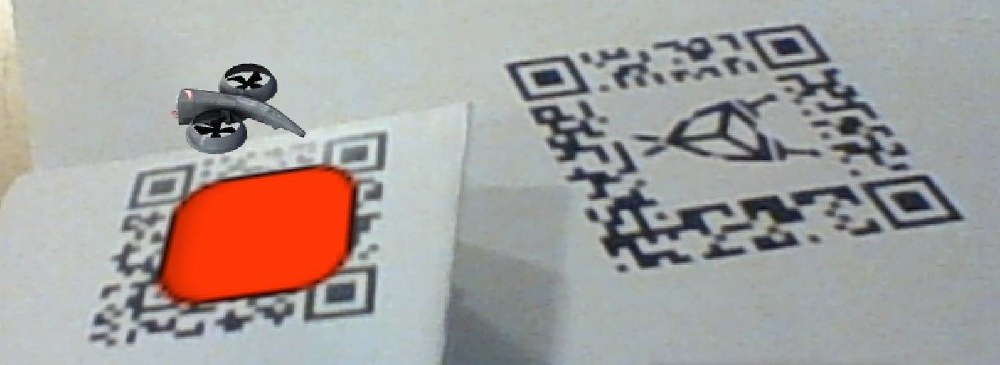
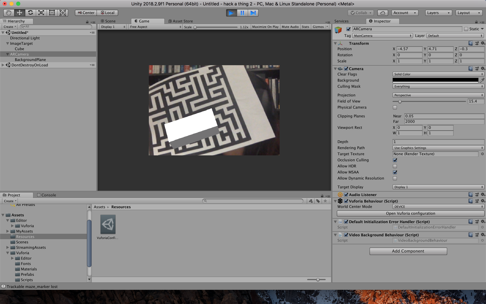
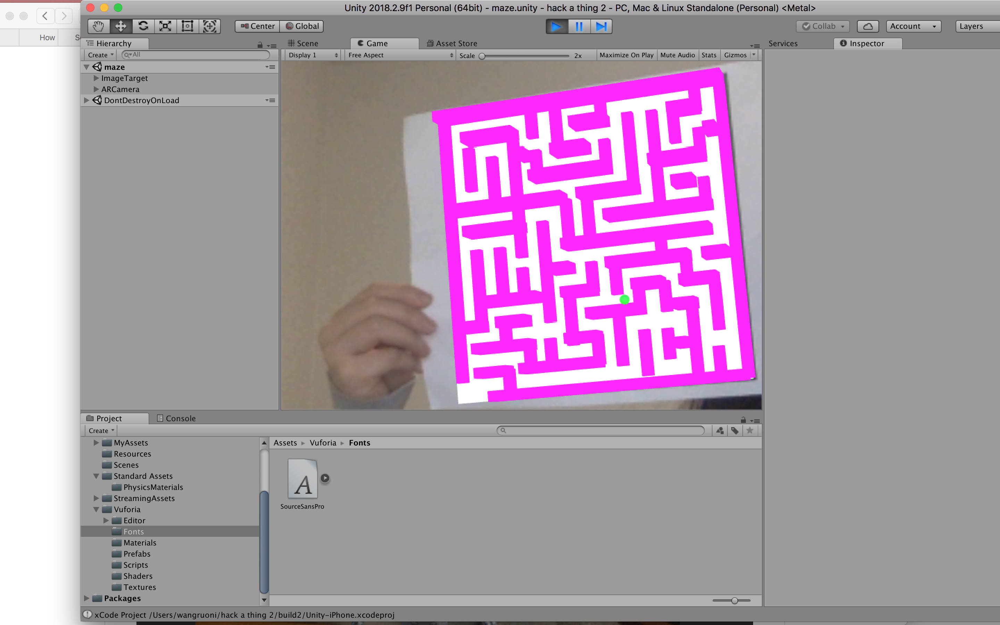
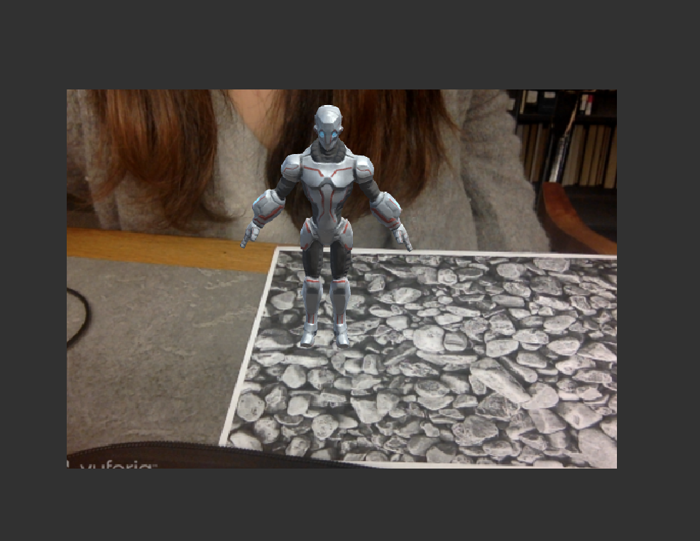

# hack-a-thing-2-unityar

## Description
We are experimenting with AR tools in Unity. We experimented with Vuforia.

## Who did what
Shirley Zhang
Stephen Liao
Ruoni Wang

#### Shirley - Drones

I used Vuforia to make an mobile AR app.  A drone model tracks and follows a QR code. I decided to do this because it was a good extension of the Unity work I did in Hack-a-thing-1. I wanted to see how easy/hard it was to make a basic AR character show up, and do something liek tracking another item. 

#### Ruoni - Maze

I used Vuforia to make an mobile AR app. I used a maze image as the image target and built all the virtual walls using box colliders. Then I created a ball that is trapped in the maze. We can tilt the maze to control the movement of the ball and aim to move it out of the maze.

I followed [this tutorial](https://www.instructables.com/id/Augmented-Reality-Tutorial-for-Beginners-With-Vufo/). 

The maze image can be detected and walls appear as expected. The ball appears and moves under gravity. However, it is still too bouncy to stay in the maze. It often bounces out of the maze in a rapid speed. I have tried change bounce to 0 for the materials used for all colliders, but it didn't reduce the bounciness. 

Also followed another tutorial to make this cyber soldier that stands on pebbles. 

##### What I learned

AR is super fun!! All my friends love it too because its rare to see things using AR. I realized a lot of tutorials were hard to follow because of version differences making the intrsutction not make sense. And since working in Unity editor is more dependant on knowing where to find things versus figuring out the logic in code, whenever they shifted something across versions it was super hard to find/ unclear if I am doing something wrong. However the results look very cool and feels super rewarding. I think it will be difficult to make a lrge scale project using VR/AR if we need to make out own assets though - defintiely need people who have taken animation/ 3D modelling on the team. Another challenge is the amount of work that goes into making movements look realistic and natural. Overall it getting something done in AR seems doable once you get the hang of it, but making details/ customizations to visuals can take a lot of time. 

## What you learned

## How does this hack-a-thing inspire you or relate to your possible project ideas?

## What didn’t work
We tried to use XCode and build IOS app for the maze. However, the phone camera is not working correctly. Even though a prompt appeared to ask if the app can access camera, the camera's view isn't rendered in the app, which in turns shows the virtual horizontal of the Unity scene. I saw that there are similar issues other people posted about IOS camera not working for Vuforia and Unity project, but couldn't make it to work after trying out different VuforiaConfig options as instructed. 

I wasn't able to control the bounciness of the ball colliding with the maze walls, despite setting bounce to 0 and added script to stop motion upon collision. I found alternative tutorials for the maze which give conflicting directions and neither really worked :( 

